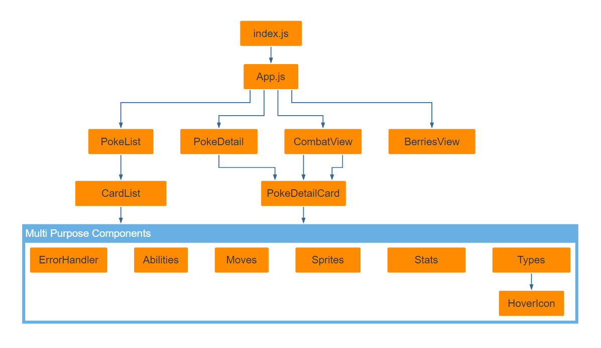

# WBS Coding School Groupwork
## Pokedex

## Group Members
Natascha, Davide, Thomas, J

# Stack
* [Node.js](https://nodejs.org/)
* [REACT.JS](https://reactjs.org/) (User Interface) using functional components 
* JS/JSX (Game logic)
* CSS (external styling)
* GIT/GITHUB (branches per team member)
* [Codesandbox.io](https://codesandbox.io) (testing, collaborative coding, bound to Github)

# How to run locally
* System requirements: [Node.js](https://nodejs.org/)
* Fork the repository
* Clone it to your local repo
* Run "npm install" to install dependencies
* Run "npm start"

# Features
* List view of all base pokemons (151)
* Search for names or part of names
* Detail view for pokemon
* Option to select two opponents
* Combat view (2 pokemons)
* Very basic combat functionality
* Central Access to most Pokemon details
  * Abilities
  * Moves
  * Sprites
  * Stats (including percentage bars)
  * Types (including hovericons)
* Berry Information page
* Modular, reusable component structure

# Structure

File  | Description
------------- | -------------
index.js      | React.JS base file
App.js  | Base App implementing fixed navigation and routing
PokeList  | 1st view, list of all (151) base Pokémon (optionally shows abilities, sprites, stats, types)
PokeDetail  | 2nd view, details for the selected Pokémon (shows abilities, sprites, stats, types)
CombatView  | 3rd view, a very basic stat comparison and combat system between two selected Pokémons 
BerriesView  | 4th view, a list of all berries
CardList  | Sub-Component used for all the cards on 1st view
PokeDetailCard  | Sub-Component used for Pokémon details (1 used in 2nd view, 2 used in 3rd view)
ErrorHandler  | Centralized error handling
Abilities  | Component to list all abilities fetched from the API
Sprites  | Component to list all sprites fetched from the API (we're using a higher-res version from an image API)
Stats  | Component to list all base stats of a Pokémon (including percentage meters)
Types  | Component to the types (e.g. electric, fire) of a Pokémon (including some hover icons)
HoverIcon  | Component to show the type using Daniel Motta's fine icons and a hover effect to display the type text
(Moves)  | not really a separate component but flexible additional loading for Pokémon moves

# Credits
* API: [Poke API](https://pokeapi.co/)
* Type Icons: Based on [Daniel Motta's free Pokémon iconset](https://www.sketchappsources.com/free-source/3954-pokemon-types-icons-sketch-freebie-resource.html) 
  * converted from sketch to svg, then to base64 inline-css
* Pokeball Illustration by [Alanyadk](https://pixabay.com/users/Alanyadk-1919646) from [Pixabay](https://pixabay.com/?utm_source=link-attribution&amp;utm_medium=referral&amp;utm_campaign=image&amp;utm_content=1536849)
* High-Res Image API (https://pokeres.bastionbot.org/images/pokemon/[id].png)

# Have fun!

Best,
Natascha, Davide, Thomas, J

